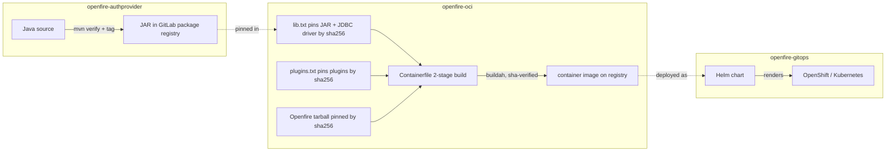
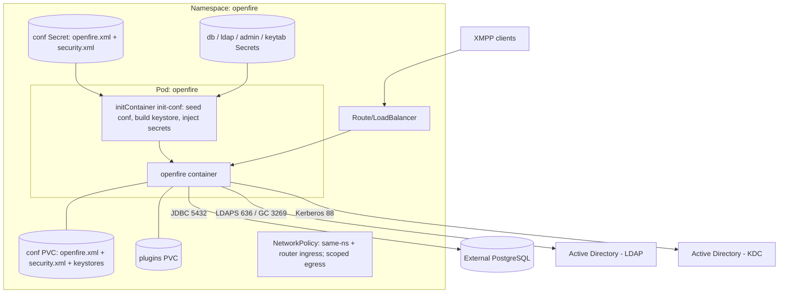
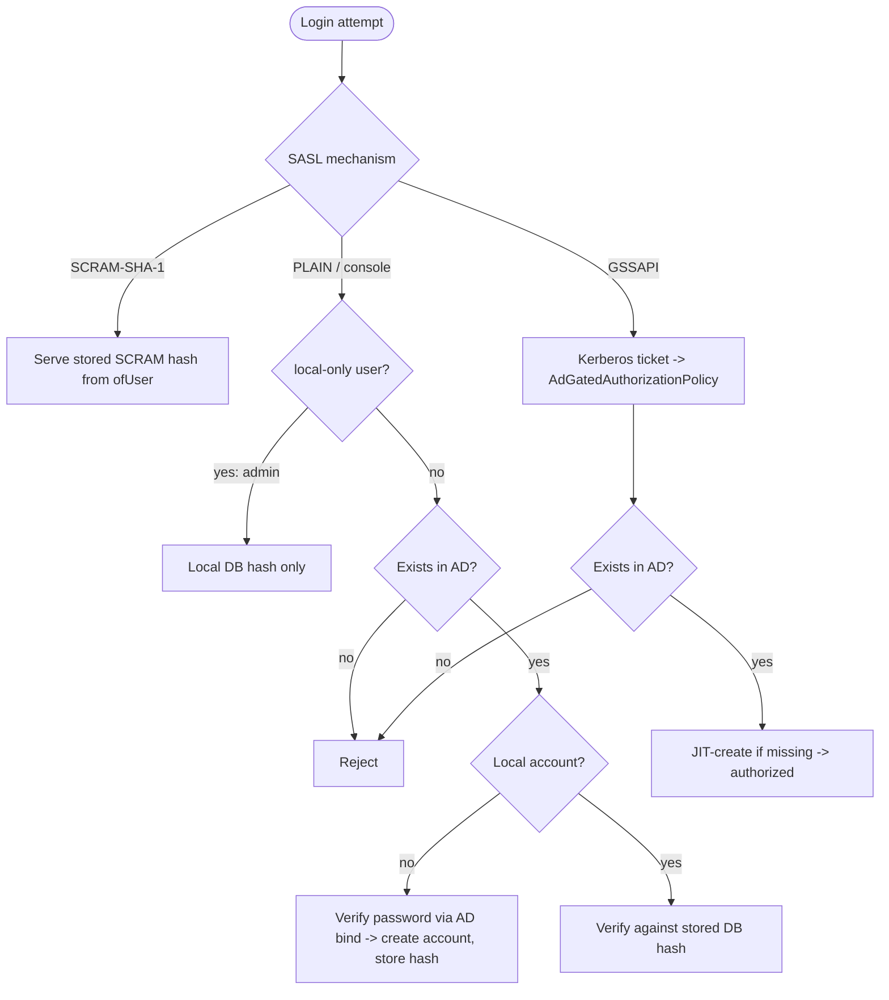

# Architecture

The front-door overview: how the three repos, Active Directory, PostgreSQL, and
Kerberos fit together — at build time and at runtime.

## The three repositories

| Repo | Produces | Consumed by |
|------|----------|-------------|
| [openfire-authprovider](https://gitlab.com/mkoese/openfire-authprovider) | a JAR (AD-gated `AuthProvider`) | pinned in oci `lib.txt` |
| [openfire-oci](https://gitlab.com/mkoese/openfire-oci) | the container image (Openfire + JDBC driver + auth JAR) | deployed by gitops |
| **openfire-gitops** (this repo) | Helm chart | the cluster |

## Build & supply chain

Everything is pinned by sha256 and flows one way — provider JAR → image → deploy.

- **Content-addressed**: the sha256 pins mean a mirror (airgapped or otherwise) is
  a drop-in — tampered bytes fail the build. See
  [openfire-oci › security](https://gitlab.com/mkoese/openfire-oci/-/blob/main/docs/security.md).
- **Custom `AuthProvider`s ship in `/opt/openfire/lib`**, not as plugins —
  providers load before plugins.

## Runtime topology

A single active Openfire node with all durable state externalized.

- **PostgreSQL** holds nearly all mutable state; the **conf PVC** holds config +
  the property-encryption key + TLS stores. They are a **matched pair** — see
  [data-lifecycle.md](data-lifecycle.md).
- **Init container** seeds config on first boot, builds the keystore/truststore,
  and injects DB/LDAP/admin passwords from Secrets (never rendered into YAML).
- **Single node** by design; clustering is a documented upgrade path
  ([README › Scaling](../README.md#scaling-beyond-one-node-clustering)).

## Authentication

Three SASL mechanisms in parallel, plus a local admin, all gated by Active
Directory for existence. Details:
[openfire-authprovider](https://gitlab.com/mkoese/openfire-authprovider).

- First password is **bootstrapped via AD bind**; afterwards the **DB hash is
  authoritative** (may diverge from AD).
- **SCRAM-SHA-1** works from the second login on (enrollment needs PLAIN or GSSAPI
  once). `admin` never touches AD.
- Only SCRAM hashes are stored (`user.scramHashedPasswordOnly=true`).

## Where to go next

| I want to… | Doc |
|------------|-----|
| Deploy it | [README](../README.md#production-configuration) |
| Understand data / backup | [data-lifecycle.md](data-lifecycle.md) |
| Configure TLS | [tls.md](tls.md) |
| Upgrade Openfire | [upgrading.md](upgrading.md) |
| Scrape metrics (Prometheus/Zabbix) | [monitoring.md](monitoring.md) |
| Turn on debug logs | [openfire-oci › logging](https://gitlab.com/mkoese/openfire-oci/-/blob/main/docs/logging.md) |
| Troubleshoot | [debugging.md](debugging.md) |
